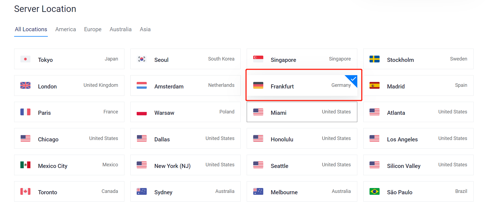
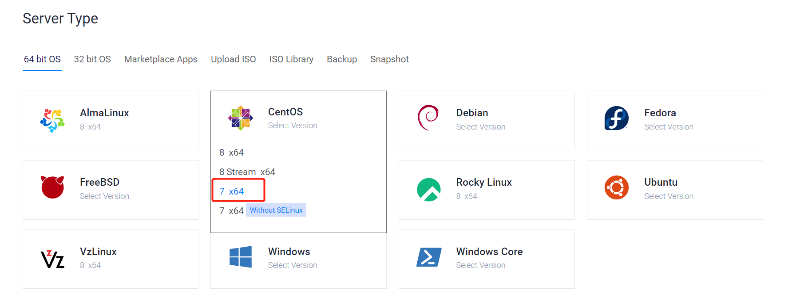
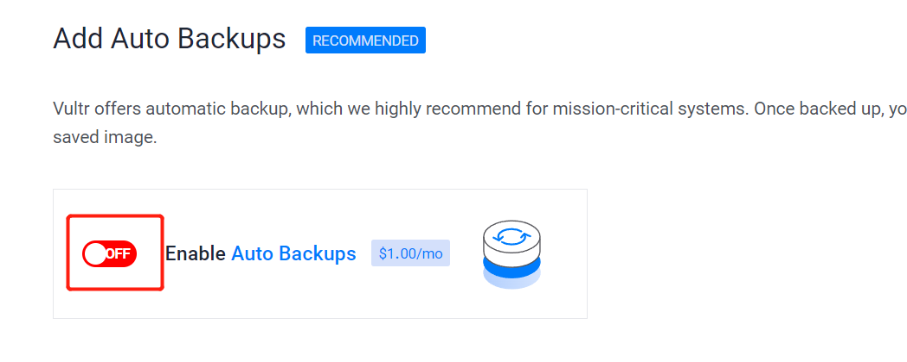

[中文版本](./README.md)

> Note: This article was translated by ChatGPT and reviewed by myself. We apologize for any semantic inaccuracies.

**[Table of Contents](https://github.com/zhaoweih/Shadowsocks-Tutorial/wiki/目录)**

> 🚀If you want to speed up your Shadowsocks, you can check out my tutorial [Kcptun Acceleration Tutorial for Shadowsocks for Beginners](./kcptun_shadowsocks_tutorial.md) (it works very effectively).
>
> If you encounter any problems that cannot be solved during the process, you can send an email to my mailbox [zhaoweihao.dev@gmail.com](mailto:zhaoweihao.dev@gmail.com) or open an [issue](https://github.com/zhaoweih/Shadowsocks-Tutorial/issues).
>
> If engineers need to speed up their git clone speed, you can check out my tutorial [Git Configuration Shadowsocks Proxy Acceleration Tutorial for Beginners](./git/git_shadowsocks_readme.md)

# Preface

Why create this library? Because there is a saying that "a programmer who cannot bypass the Great Firewall is not a good programmer". However, for some reasons, bypassing the firewall is becoming increasingly difficult. I used to use a certain VPN service, but it has become unstable since last month. I thought I could stick with it for a while, but then I switched to Shadowsocks. Why did I choose Shadowsocks? Because it allows you to set up your own server and not be constrained by anyone else. Also, since it is a personal server, the chances of its IP being blocked are not very high. Of course, you can also share it with people you trust. However, the tutorials for Shadowsocks on the internet are not consistent and can easily mislead those who just want to bypass the firewall without understanding the principles behind it. Therefore, I came up with an idea: to create an almost one-click, idiot-proof tutorial for setting up Shadowsocks (hereinafter referred to as SS) for novices, so that everyone can share the freedom of the Internet.

# Getting Started

## Purchase a VPS Server

As the saying goes, "the beginning is always the hardest." It's true that buying a VPS server isn't particularly difficult, but accepting it can be a bit challenging. When I first tried to purchase a server, I was a novice who had never bought one before and had no idea where to start. But now you can rest assured that, based on my personal experience, Vultr and DigitalOcean are two service providers that allow you to deploy and destroy servers at any time, and they charge by the hour. It costs $5 per month, or roughly $0.007 per hour. Even if you create a server and its IP is blocked by the Great Firewall, you can simply delete it and it will only cost you $0.1. As a poor student, I can definitely afford this. So, what are you waiting for?

### 1. Register and Log In

I recommend using Vultr for this tutorial. You can sign up using this referral link: https://www.vultr.com/?ref=7370522

Why do I recommend Vultr? Because they have servers in Japan with low latency and low packet loss. After registering and logging in, you need to recharge your account with at least $5. You can use PayPal to bind your domestic bank card and recharge with a minimum of $5, or you can use Alipay, which requires a minimum recharge of $10.


### 2. Deploying the Server

Step 1: On your personal page, click on "Products" and then click on the "+" button on the right side to add a server.


Select "Cloud Compute."


Select "Regular Performance."


Step 2: On the page that opens, select the Frankfurt server in Germany. (Due to the abuse of Japanese servers, many IPs have been blocked. You can choose European servers, such as France or Germany.) You can also choose other servers if you prefer. The subsequent operations are the same.



Step 3: Next, pay attention to the system selection. It's recommended to choose **CentOS 7 x64**. Click on CentOS and select 7 x64 from the drop-down menu.



Step 4: Choose the package. Of course, you don't need a server with high configuration for SS. The lowest package that costs $5 per month is sufficient. Every time I check, the package that costs $2.5 is always sold out. If you can see it, be sure to choose it quickly. It's a rare opportunity.


Remember to **uncheck "Enable Auto Backup"** (which costs $1 per month).



Step 5: Then you can deploy the server. You can also give the server a name before deployment.


Step 6: Wait for the server to start up. When the Status turns green and shows "Running," it means the server has started up successfully. This process usually takes 1-3 minutes.


Step 7: Copy the IP address and password. They will be useful later.


Step 8: After the server has started up, it's recommended to test if the IP address has been blocked. Open the command prompt or terminal, and type in "ping" followed by your IP address. For example, if the IP address of your server is 8.8.8.8, type in "ping 8.8.8.8". If the return message is as shown in the image below, then the IP is available. Occasionally, a "request timeout" is also acceptable, which means that some packets have been dropped. However, if "request timeout" persists, you should delete the server and deploy it again.


Great! The most difficult part is over. From now on, it's almost a one-click process. Take a break and enjoy a cup of tea 🍵 before continuing.


## Installing SS on the Server

Since I use a Mac, and most people use Windows, I took out my old computer and booted it up to continue this tutorial. It's running Windows 7.

- **If you are using a Mac, congratulations! You can simply open the terminal and enter the following command to connect to your server:**

```bash
ssh root@your_server_ip_address
```

**Then you can skip the steps for installing and running Xshell.**

- **If you are using Windows 10, you can use the built-in PowerShell tool:**


**Enter the following command:**

```bash
ssh root@your_server_ip_address
```


**Once connected, you can skip the steps for installing and running Xshell.**

### Installing and Running Xshell

**Note: If the server can be pinged but Xshell cannot connect, it means that the port of the server is blocked. (This is a common situation for Vultr's Japanese servers.) Please switch to servers in other regions or change the server provider.**

To connect to the server via SSH on Windows, you need to download Xshell. You can search for it on Baidu, or use any other SSH client you prefer. Here, we will use Xshell as an example. After installing Xshell, click on File - New.


Next, configure the connection. You can give it any name you want. For the Host field, enter the IP address of your server. You can leave the rest of the fields at their default settings.


Next, in the window that appears, enter "root" (which is the default username for the server).


Here, you need to enter the server password that you copied earlier in the tutorial.


### Installing SS

After successfully logging in, the screen will look something like this:


Now comes the most important part. Thanks to the one-click installation script created by [@teddysun](https://github.com/teddysun), you can easily install SS on your server. For more details, you can visit his blog at https://teddysun.com/486.html. (Note: the script can still be used, but it is no longer being updated since the author has retired. )

Here are the commands you need to enter:

```bash
wget --no-check-certificate -O shadowsocks-all.sh https://raw.githubusercontent.com/teddysun/shadowsocks_install/master/shadowsocks-all.sh
chmod +x shadowsocks-all.sh
./shadowsocks-all.sh 2>&1 | tee shadowsocks-all.log
```

Copy and paste the above code into Xshell. You will need to right-click to paste. A long string of code will appear, and it will stop at a certain point.


Press the **Enter** key once, and the installation process will continue.

Next, a prompt will appear asking you to select the server version for SS. Here, I will choose the "libev" version. Enter **4** and press Enter.


As usual, you will need to enter a password for the SS client. Here, I will enter the password **abc123456**


Next, you will be prompted to enter a port number (any number between 1-65535). Here, I will choose **12853**


After that, you will need to choose an encryption method. I recommend choosing **xchacha20-ietf-poly1305**, so enter **13**


Next, you will be prompted to choose whether or not to enable the simply-obfs plugin. You can leave this at its default setting and press Enter.


Then, simply press Enter again.


You may need to wait for a while, but once the installation is complete, you will see a message like the one in the screenshot below. Congratulations! 🍻

I recommend taking a screenshot of this page so you don't forget the important information: your server's IP address, server port, password, and encryption method.


If you have followed my instructions up to this point, then you should have successfully installed the server-side of SS. However, in order to use SS, you will also need to install the client-side software on your computer or mobile device. Below are the download links for various platforms (I have personally used SS on Windows, MAC, Android, and IOS, and the steps for using it are similar for each platform.):

Windows: https://github.com/shadowsocks/shadowsocks-windows/releases

Android: https://github.com/shadowsocks/shadowsocks-android/releases

MAC: https://github.com/shadowsocks/ShadowsocksX-NG/releases

Linux: https://github.com/shadowsocks/shadowsocks-qt5/wiki/Installation

IOS:

Due to the removal of VPN apps from the Chinese App Store, including those that support SS, you need to switch to a foreign account.

We recommend that you register a foreign account instead of changing your domestic account's region. This allows you to switch between domestic and foreign accounts when downloading apps.

**If you don't want to go through the trouble, you can buy a foreign App Store account on Taobao, which is cheap, convenient, and fast.**

Steps:

1. Get an account from outside the country.

Tutorial for registering foreign App IDs: https://www.zhihu.com/question/26458172

(There are many tutorials on registering foreign accounts, you can search for them yourself.)

**Due to Apple's new policy, when registering an Apple ID, if the payment method is not available in the local region, the "none" option cannot be selected. For example, if I register a UK account, I need to use a UK IP address to register. In other words, when registering, use a VPN to match the corresponding IP address.**

1. Switch to a foreign account in the App Store.
2. Search for **Potatso Lite** in the App Store and install it.

Note: Other SS-supported apps can also be used, but we recommend Potatso Lite.

- [Potatso Lite](https://itunes.apple.com/us/app/potatso-lite/id1239860606?mt=8)


**Now let's take Windows as an example:**

Open the above URL to download the client:


Then, after decompressing, open Shadowsocks.exe, right-click the small airplane in the lower right corner, and click Server-Edit Server:


Remember the picture recommended to be saved above? It will be used here. Fill in the server IP, port, password, encryption method, and click OK.


Finally, make sure to turn on PAC mode:


- Here's a brief description of PAC mode and global mode:

PAC mode: when accessing domestic websites, it will use domestic IP; when accessing blocked websites, it will use server IP.

Global mode: all traffic goes through server IP.

It is recommended to choose PAC mode, and the PAC addresses are saved in [gfwlist](https://github.com/gfwlist/gfwlist).

If you encounter websites that cannot be accessed in PAC mode, please report issues.

### The moment of truth

Finally, the most important moment has arrived. Type google.com in your browser and hit Enter. And voila, Google is back!


# Additional Information

## Set Multiple Ports

[How to Enable Multiple Ports for Shadowsocks](https://stanleyzhao.xyz/2019/06/01/%E5%A6%82%E4%BD%95%E5%90%AF%E7%94%A8Shadowsocks%E7%9A%84%E5%A4%9A%E7%AB%AF%E5%8F%A3/)

## Common Commands

### Shadowsocks-libev  Version:

```bash
/etc/init.d/shadowsocks-libev start
/etc/init.d/shadowsocks-libev stop
/etc/init.d/shadowsocks-libev restart
/etc/init.d/shadowsocks-libev status
```

### Shadowsocks-Python  Version:

```bash
/etc/init.d/shadowsocks-python start
/etc/init.d/shadowsocks-python stop
/etc/init.d/shadowsocks-python restart
/etc/init.d/shadowsocks-python status
```

### ShadowsocksR  Version:

```bash
/etc/init.d/shadowsocks-r start
/etc/init.d/shadowsocks-r stop
/etc/init.d/shadowsocks-r restart
/etc/init.d/shadowsocks-r status
```

### Shadowsocks-Go  Version:

```bash
/etc/init.d/shadowsocks-go start
/etc/init.d/shadowsocks-go stop
/etc/init.d/shadowsocks-go restart
/etc/init.d/shadowsocks-go status
```

## How to Uninstall

Run the following command and select the corresponding version for uninstallation according to the prompt.

```bash
./shadowsocks-all.sh uninstall
```

# Finally

Finally, our task is completed here, but if you want to optimize the server connection, you can install BBR acceleration. You can refer to this article for details: [Article](https://teddysun.com/489.html)

> Login with root user and run the following command:
>
> ```bash
> wget --no-check-certificate https://github.com/teddysun/across/raw/master/bbr.sh && chmod +x bbr.sh && ./bbr.sh
> ```
>
> After installation, the script will prompt to restart VPS, enter y and press Enter to restart.

# Update

## 201210 Update

Tips: If you want to use domestic servers (such as Alibaba Cloud, Tencent Cloud, etc.), it is recommended to [reinstall the system with a one-click DD system](https://ssr.tools/693) to get a clean system before setting up Shadowsocks. Otherwise, you may receive a warning email.

## 190518 Update

[Add instructions on installing EPEL on AWS #8](https://github.com/zhaoweih/Shadowsocks-Tutorial/issues/8)

## 190203 Update

If you want to test the download and running speed of your server, you can check out this article: [Article](https://teddysun.com/444.html)

> Just run this command:
>
> ```bash
> wget -qO- bench.sh | bash
> ```


Here are some speed test results of my servers. I hope it's helpful for you to choose a server:

- DigitalOcean Singapore, $5/month: 

  

- VPSServer Tokyo, $4.9/month: 

  

- HostUS Hong Kong, $2.95/month: 

  

- AWS Korea, free for one year with EC2:


## Update on 2018/06/24

If you want to customize your PAC rules, that is, if you want to visit a website that is not in the PAC directory, you can add it yourself. For example, if I want to add GitHub to the PAC custom protocol, the format is as follows:

```
||github.com
```

After adding it, **remember to restart Shadowsocks to take effect**. URLs that contain github.com, such as api.github.com and github.com/zhaoweih, will use the server IP.

# Q&A

Here are some questions collected from emails:

**[Resolved] 1. Problem: -bash: wget: command not found Environment: Server: Linode, Singapore server, CentOS 7**

You can try to install wget by referring to this article: https://www.wn789.com/5624.html

**[Resolved] 2. Problem: When accessing Google Scholar, it prompts: "We are sorry, but your computer or network may be sending automated queries. To protect our users, we can't process your request right now."**

Because Google has its own anti-proxy spider mechanism, many VPS IPs will be detected by Google as proxies. If you encounter this situation, you can switch to another server. If there are no other servers available, you can use the [Google Scholar Mirror](https://lai.yuweining.cn/archives/2112/).

**[Resolved] 3. Install EPEL repository failed error on AWS EC2**

Refer to this article: [http://blog.openpilot.cc/archives/aws-ec2%E6%8A%A5%E9%94%99install-epel-repository-failed%E7%9A%84%E8%A7%A3%E5%86%B3%E5%8A%9E%E6%B3%95/](http://blog.openpilot.cc/archives/aws-ec2报错install-epel-repository-failed的解决办法/)

**[Resolved] 4. [Error] Failed to install python**

The problem of unable to install due to CentOS 7 being not selectable in the previous article can be resolved by trying to install on **Debian10x64** system [#27](https://github.com/zhaoweih/Shadowsocks-Tutorial/issues/27).

# Discussion

## Discord

**I have created a Discord chat room for those who have questions and want to discuss**

[](https://discord.gg/wHFxCVk)

**For those who want to learn more about Shadowsocks and the knowledge of circumventing internet censorship, please refer to the following article**

- [A Brief Introduction to the Relationship and Differences between VPN, VPS, Proxy, and Shadowsocks](https://medium.com/@thomas_summon/浅谈vpn-vps-proxy以及shadowsocks之间的联系和区别-b0198f92db1b)

# Suggestions

If you have any questions about this article, you can create an [issue](https://github.com/zhaoweih/Shadowsocks-Tutorial/issues). If you have simpler or alternative methods for circumventing internet censorship, you can also submit a pull request.

# About

I am a young worker who seeks freedom. If you want to contact me, you can send me an email 📧

📮 My email: [zhaoweihao.dev@gmail.com](mailto:zhaoweihao.dev@gmail.com)

# Donations

I am currently living a relatively comfortable life with food and drink, so there is no need to donate. If you like this article, you can give me a star or fork ❤️, thank you!